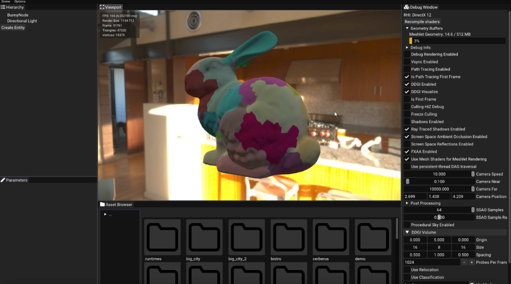
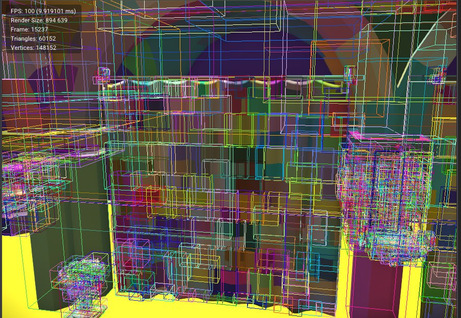
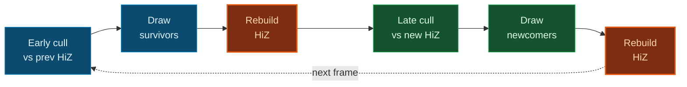
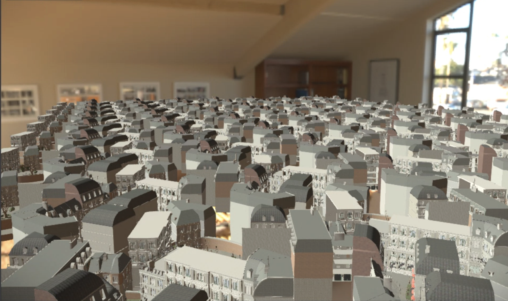
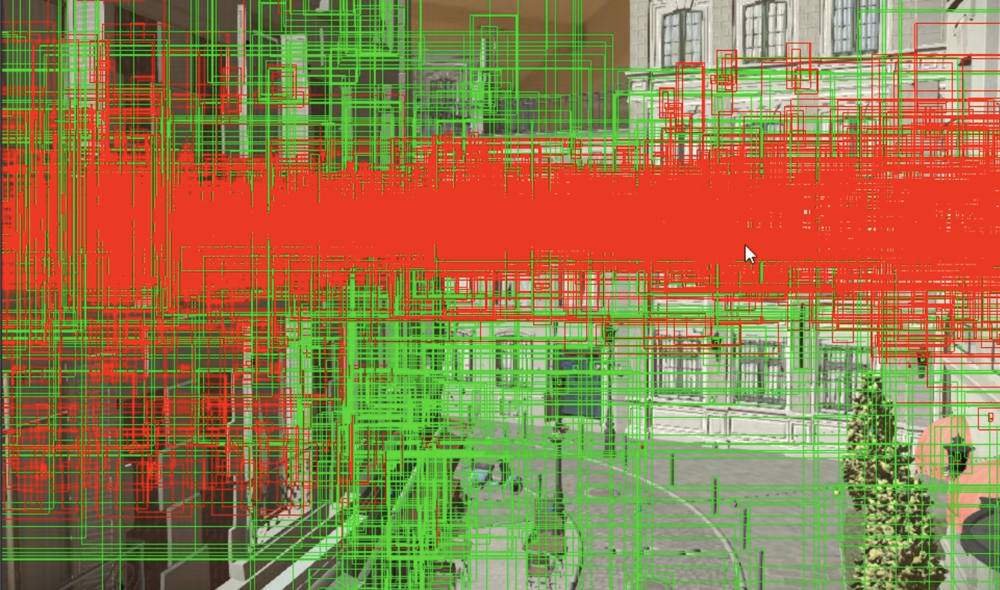
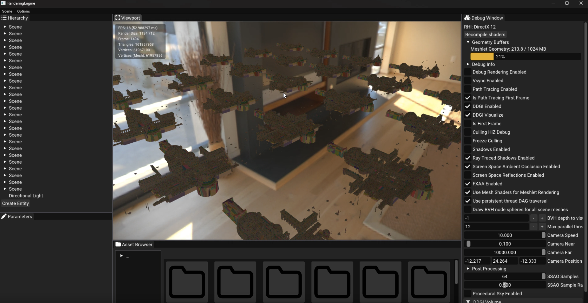
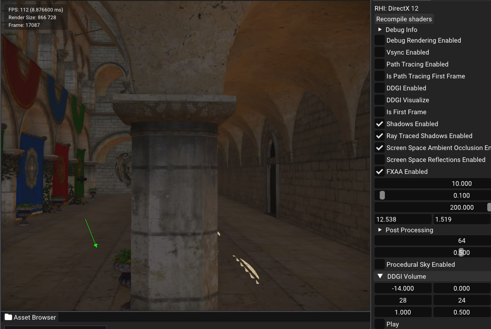
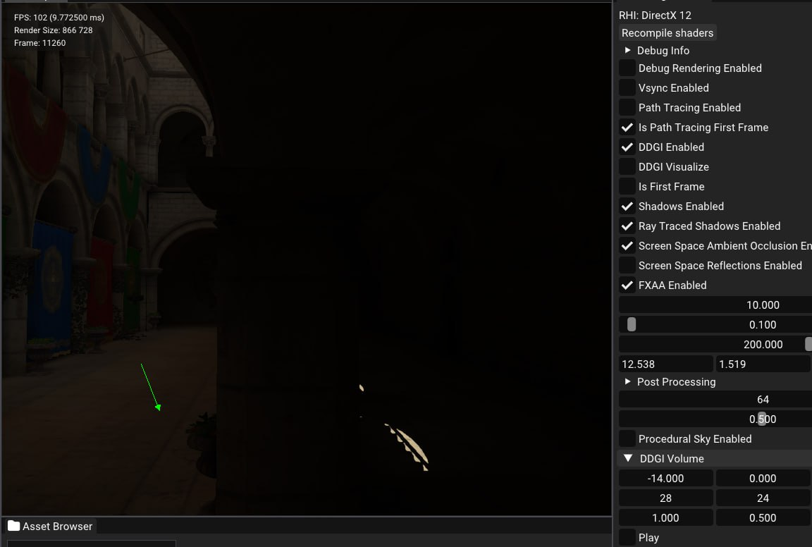
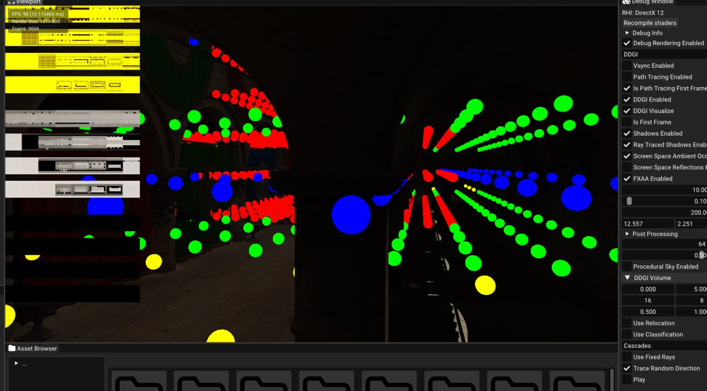
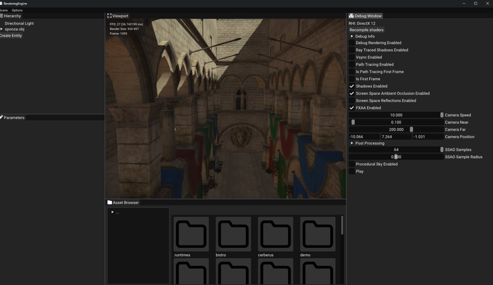

# RenderingEngine

An experimental Vulkan / DirectX 12 renderer exploring cutting-edge rendering tech. Geometry is fully GPU-driven through a Nanite-style meshlet pipeline - continuous LOD, mesh shader rasterization (with a compute fallback), two-pass HiZ occlusion culling, on-demand streaming for scenes larger than VRAM. Real-time global illumination via hardware ray-traced DDGI, plus a reference path tracer for ground truth.

## Meshlet geometry

Geometry goes through a meshlet pipeline. Meshes are split into clusters of ~64 vertices / ~124 triangles using [meshoptimizer](https://github.com/zeux/meshoptimizer) at import time and baked into a binary `.mesh` file along with their LOD hierarchy.

### Continuous LOD

Each mesh is preprocessed into a DAG of meshlet groups by iterative simplification. At runtime each group picks its own LOD based on screen-space error.

### GPU-driven culling

Culling happens on the GPU. Instances are expanded into per-meshlet work items, each meshlet gets frustum + backface + occlusion tested, and survivors are appended into an indirect buffer. There is no per-object CPU draw submission - the whole scene renders as a handful of indirect dispatches.

### Two-pass HiZ occlusion

The previous frame's HiZ is a great occluder for most of the scene but misses anything that just became visible this frame. Two passes solve it:

| Scene | Occlusion debug |
|-------|-----------------|
|  |  |

### Geometry streaming

Meshlet data streams in on demand: the GPU asks for what it needs while traversing the LOD hierarchy, the CPU uploads it, and groups that haven't been used in a while get evicted. A coarse root group per mesh stays pinned as a fallback, so the scene always renders even when finer detail hasn't streamed in yet. This is how the engine handles scenes larger than VRAM - for example, 25 copies of the 70 GB NVIDIA Zorah scene packed into one world, streaming in and out as the camera moves.

## DDGI

Real-time global illumination via a grid of light probes. Each frame a budget of probes shoots rays against the scene with hardware ray tracing, samples direct lighting at the hits, and writes the result into per-probe irradiance and depth atlases.

| DDGI on | DDGI off |
|---------|----------|
|  |  |

### Cascades

Probes aren't a single grid - they're arranged in nested cascades around the camera. The innermost cascade is dense for fine GI near the viewer, outer cascades are progressively sparser and bigger, so the same probe budget reaches the whole scene without wasting density where it doesn't matter.

Additional probes passes:

- **Relocation** - probes that land inside walls get nudged into open space so they sample something useful.
- **Classification** - probes trapped in solid geometry or floating in empty space are flagged inactive and skipped, saving a big share of the ray budget.
- **Ray modes** - fixed directions per probe for stable convergence, or randomized each frame for faster response to dynamic lighting.

Per-frame cost is bounded by `probes_per_frame` × `rays_per_probe`, so the GI stays at a fixed budget regardless of volume size.

## Other features

- **Lighting** - deferred PBR with directional and point lights, IBL (prefiltered specular + diffuse irradiance + BRDF LUT)
- **Shadows** - directional lights (cascaded shadow maps), point lights (cube shadow maps), with optional ray-traced shadows
- **Path tracer** - reference path tracer, used as ground truth
- **RHI** - single abstraction over Vulkan and DX12 with fully bindless resources
- **FrameGraph** - automatic layout transitions, transient resources, GraphViz visualization
- **Tooling** - Tracy CPU + GPU profiling, console variables, debug visualizations
- **Physics** - PhysX integration

Plus SSAO, SSR, FXAA, procedural atmospheric sky, and a post-processing effects.

## Coming next

- **RTX Mega Geometry** - use meshlet cluster data in ray tracing
- **Per-pixel ray-traced GI** - per-pixel ray-traced indirect lighting on top of DDGI
- **Path tracer improvements** - expand material support and integrate NVIDIA NRD denoisers
- **Upscalers** - DLSS and FSR
- **MaterialX** - basic support of the MaterialX standard
- **macOS support** - Metal 4 backend
